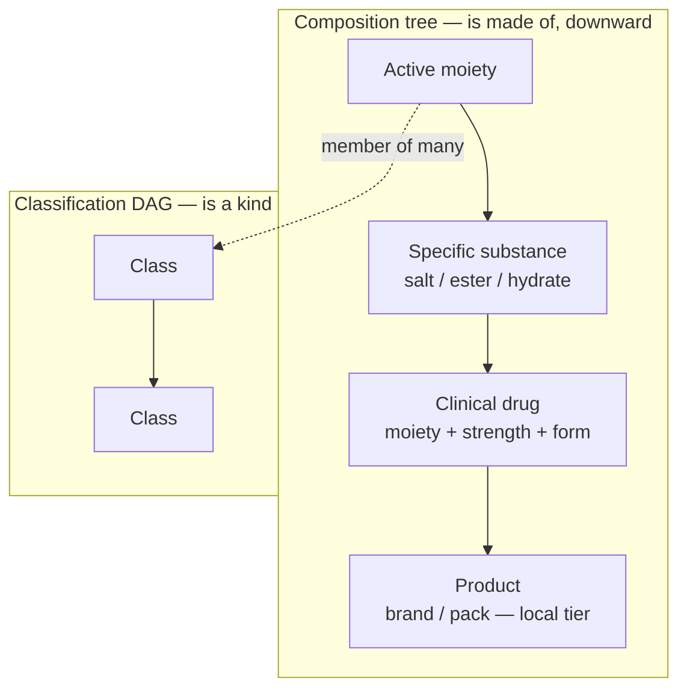

# Architecture

drugref is an **advisory, fit-for-purpose** service: ingest and normalisation are
written in plain Python (fast iteration over brittle upstream feeds), but **data
integrity is enforced in the database, not in application code** — constraints,
triggers, and (later) row-level security. The substrate is Python 3.12 + `uv`,
`psycopg` v3, and PostgreSQL ≥ 18.

## Two orthogonal structures

drugref models medicines as two independent graphs that a moiety sits in at once:

1. **Composition tree** (*is-made-of*): active moiety → specific substance → clinical
   drug → product. Product is the local tier.
2. **Classification DAG** (*is-a-kind-of*): `class ⊂ class`; a moiety belongs to many
   classes across several axes (chemical / mechanism / therapeutic) — many-to-many, a
   link, never a parent foreign key.

Curated knowledge attaches to nodes in **either** structure and **inherits along the
edges** (down the tree, up through a moiety's classes) — curate once, apply widely.

## The hybrid store

Two kinds of data with opposite update semantics live side by side:

- **Rebuildable projections** — everything ingested from a public feed. Drop-and-rebuild
  per source, version-pinned, provenance-tagged via `ingest_run`. A new upstream release
  cleanly replaces its own projection.
- **An append-only, signed overlay** — curated knowledge (the durable value-add, e.g.
  interaction severity and management). Never overwritten.

See the decision record on the [hybrid store](../decisions/hybrid-store.md).

## Immortal identity & append-only claims

Every active moiety has its own **immortal `moiety_uuid`** — a `UUIDv5` derived
deterministically from its UNII and pinned forever. External identifiers attach as
**append-only claims**; corrections *supersede* rather than overwrite. Two decision
records cover this: [immortal moiety identity](../decisions/immortal-moiety-identity.md)
and [append-only claims](../decisions/append-only-claims.md).

## Classification & membership

Drug classes come from **MED-RT** (mechanism of action, physiologic effect, therapeutic
class, and more) and **MeSH pharmacologic actions**, in a single source-neutral class
registry. A moiety joins a class through identifier claims drugref already holds
(`RXNORM_IN` for MED-RT; UNII / CAS for MeSH). Class edges are **rebuildable
projections**, deliberately outside the append-only floor.

## Where the parts live

Ingest parsers are **pure and streaming** (no database access); orchestrators
(`ingest/*_run.py`) own the transaction and are the only writers. The code lives under
`src/drugref/` (`ids`, `claims`, `classes`, `db`, and `ingest/*`). For the full
derivation of any slice, see the design specs in the
[repository](https://github.com/cairn-ehr/drugref/tree/main/docs/superpowers/specs).
